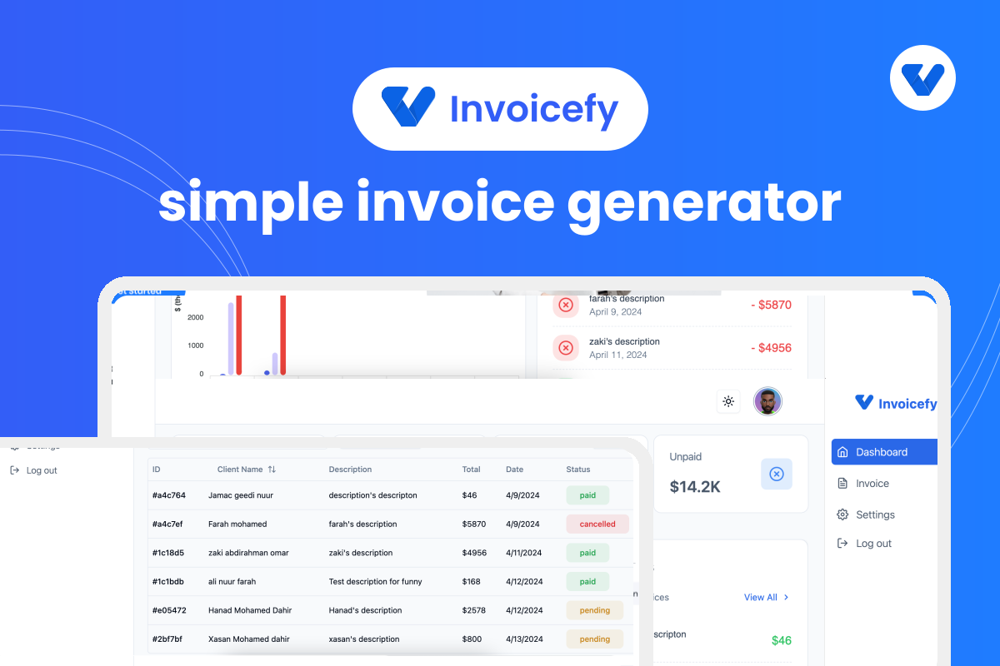

# Invoicefy - A simple invoice generator

Invoicefy is a web-based application that allows users to create and download invoices in PDF format. Users can also view all invoices, track the status of invoices, and manage their profile and settings. The application is built using React,Typescript, Node.js, Express, and MongoDB. The frontend is built using React and Zustand for state management, while the backend is built using Node.js and Express. MongoDB is used as the database, and Firebase is used for image storage. The application also uses shadcn ui for the design.



## Table of Contents

- [Features](#features)
- [Tech Stack](#tech-stack)
- [Installation](#installation)
- [License](#license)
- [Author](#author)
- [Contribution](#contribution)

## Features

- Create and download invoices in PDF format.
- View all invoices.
- Track the status of invoices.
- Responsive design.
- User authentication.
- User profile.
- User settings.
- personliased dashboard.

## Tech Stack

- React
- Node.js
- Express
- MongoDB
- Zustand
- firebase
- shadcn ui

## Installation

1. Clone the repository

```bash
git clone https://github.com/hanad124/invoicefy.git
```

2. Install dependencies

```bash
cd server && npm install
cd client && npm install
```

3. Create a `.env` file in the server directory and add the following environment variables

```bash
PORT=5000
MONGO_URI=your_mongodb_uri
JWT_SECRET=your_jwt_secret
```

4. Create a `.env` file in the client directory and add the following environment variables

```bash
REACT_APP_API_URL=http://localhost:5000
```

5. Run the server

```bash
cd server && npm run dev
```

6. Run the client

```bash
cd client && npm run dev
```

7. Visit `http://localhost:5173` in your browser

## License

MIT License

```
MIT License

```

## Author

- [Hanad Mohamed](https://github.com/hanad124)

<!-- contribution -->

## Contribution

Contributions are always welcome!
